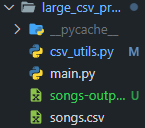

# bmat_test

Test made for BMAT MUSIC INNOVATORS

---

## Requirements

Some of the main requirements to execute the whole test are:

* Python 3.10
* Django 4.2
* adrf 3.6.0
* daphne 4.0.0

The rest of the requirements can be reviewed on the text file called requirements.txt located on the base project path.

## Installation

First you must make sure you are working on a virtual environment. For it locate and execute the script activate, to start the venv.

***For Windows***

```powershell
Scripts/activate.ps1 
```

***For Linux/MacO**S*

```
cd Scripts 
activate
```

Then all the requirements can be installed from the main directory

```shell
pip install -r requirements.txt
```

## Test Execution and Explanation

Now, it will be explained how to execute the module and the django project.

### Large CSV Processing

In order to build a good module Clean Code was applied using PEP-8 styling reference and SOLID principles. In that way each class has it's own responsibility and executes one function.

Pandas library was used to simplify data manipulation and extraction, each time when reading the file and storing it into a data frame, pandas loops throughout the whole file so its executions are constant. However due to the memory limitations it was decided to divide the data into chunks and, group and sum their values, and then join the whole csv back again joining and summing the remaining values. In that way the whole execution ignoring the constant time executions (such as opening and closing files, and writing the data) the whole function has a time complexity of (N+K+M) M is the total of chunks, N the rows for each chunk and then K the result of summing and grouping the chunks back together.

In order to execute the function you can call it or use it internally on the main.py module, while calling the function it looks for a file as an argument and it must be on the same directory, so in case you want to use a file outside de directory you must call it's **absolute path**.

```shell
$large_csv_processing> python main.py 
```

    

Once the function is executed you can see the input file being songs.csv and the output file songs-output-{uid}.

### BMAT CSV API

On the other hand, to develop the csv converter api it was used django-rest-framework, due to its speed to develop well documented apis, and also because it is the most popular framework (and the one which I have most experience on). In that way, first the main model was created.

    

Each field its used in order to give the user enough information about the file transformation.

Then, each serializer was defined depending on which view it was going to be used.  So for the GET methods (Listing and Detail Views), it was used the get serializer and the Create View Serializer was used to supply the POST methods.

    

Afterwards each view was created, there async views where inherited using **adrf library** and in order to apply threading while converting the file, a new Thread is created and started executing the csv converting function.

    

There as you can see when creating a new csvtask, it first creates an object on a async function, then a thread is created to conver the file, and while it is being converted the response is already recieved. Lastly, one templated was created to allow downloads.

To execute the project you must have installed all the requirements located in requirements.txt, then go to bmat_csv folder and execute the next commands.

```shell
python manage.py makemigrations
python manage.py migrate
```

After the migrations are made, each model will be created as a Table in the sqlite file. Then you can create a superuser in case you want to access the admin panel directly.

```
python manage.py createsuperuser
```

Next you will be asked to fill basic information to create a new superuser. Then you can start the local server.

```
python manage.py runserver
```

Then you must see that in your terminal a local server has started. You can access the api through HTTP requests or directly through your browser. Using the url **127.0.0.1/docs** you can see the API documentation.

    


After that you can access directly to each endpoint and make petitions.


**In case you want to make sure the thread is working async,** you can modify the *convert_file* function located in *csv_api/models.py* by *a*dding more time to the time.sleep().

## Notes

* To improve data manipulation space/time efficiency, each chunk can be processed using multi-threading.
* Views and functions threading can be optimized using Celery and Redis brokers.
* Maybe another solution could be using Fast API with its native async views.
* More time was needed to perform the tests closely .
